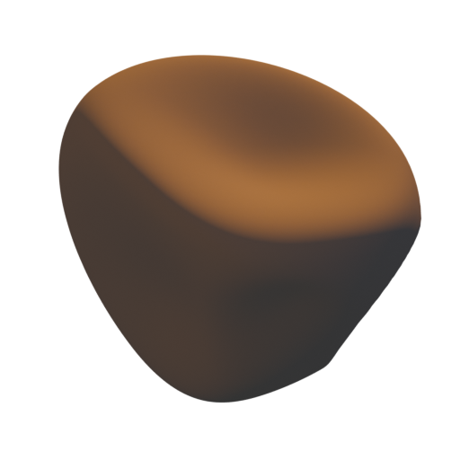

# Johannes Palvanen

This is the source code for my personal website [https://johannespalvanen.com](https://johannespalvanen.com).

## How to build & deploy

1. Run `deno run build`
2. Commit & push the resulting artifacts, that get generated to `/docs`, to `main` branch
3. GitHub will automatically serve the files from the `/docs` directory